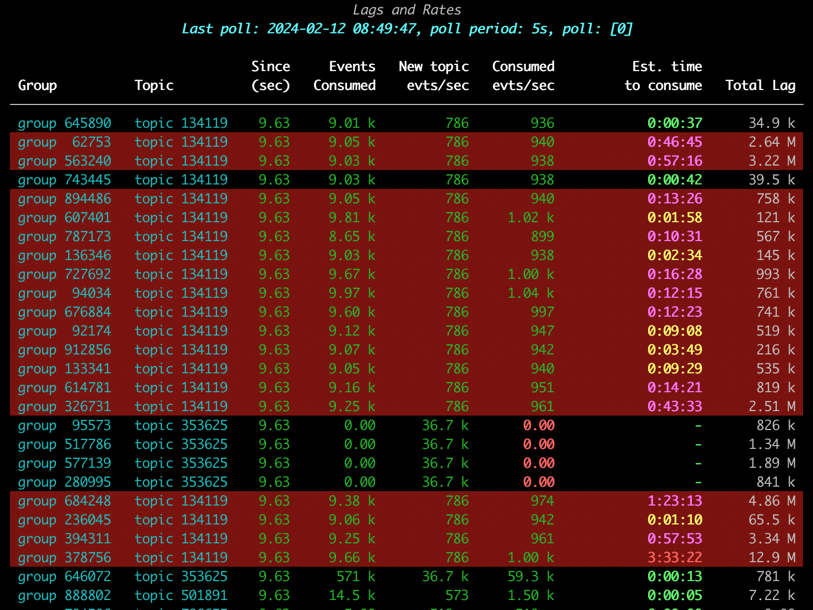
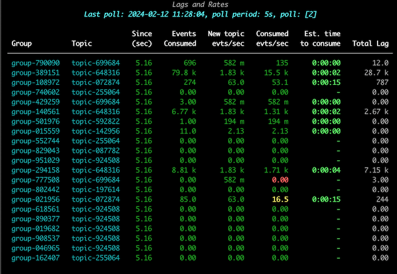
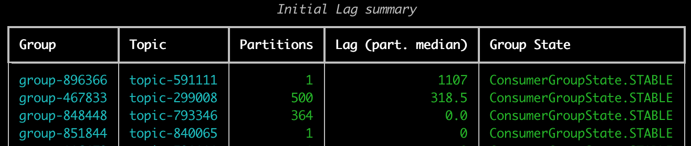

# kafkatop

CLI app to monitor real-time consumption and production rates on kafka broker. 

Shows:

* A brief with topic and partitions lists and consumer group statuses
* Rate of events written to topics
* Rate of events consumed by consumer groups, per topic
* LAG per consumer group and topic
* ETA for each consumer group to consume the remaining topic events

Supports:
* Name filtering
* Multiple topics/consumer group
* Showing only troublesome groups, useful if you have hundreds
* Exporting status in json for mass health surveillance of remote hosts


# Usage
```
usage: kafkatop.py [-h] [--kafka-broker KAFKA_BROKER] [--text] [--poll-period KAFKA_POLL_PERIOD]
                   [--poll-iterations KAFKA_POLL_ITERATIONS] [--group-exclude-pattern KAFKA_GROUP_EXCLUDE_PATTERN]
                   [--group-filter-pattern KAFKA_GROUP_FILTER_PATTERN] [--status] [--summary] [--info] [--info-parts]
                   [--only-issues] [--anonymize] [--all] [--version]

Kafka consumer statistics

options:
  -h, --help            show this help message and exit
  --kafka-broker KAFKA_BROKER
                        Broker IP (default: localhost)
  --text                Only plain text, no rich output. (default: False)
  --poll-period KAFKA_POLL_PERIOD
                        Kafka offset poll period (seconds) for evts/sec calculation (default: 5)
  --poll-iterations KAFKA_POLL_ITERATIONS
                        How many times to query and display stats. 0 = Inf (default: 15)
  --group-exclude-pattern KAFKA_GROUP_EXCLUDE_PATTERN
                        If group matches regex, exclude (default: None)
  --group-filter-pattern KAFKA_GROUP_FILTER_PATTERN
                        Include *only* the groups which match regex (default: None)
  --status              Report health status in json and exit. (default: False)
  --summary             Display a groups, topics, partitions, and lags summary. (default: False)
  --info                Only show informational data about the cluster, topics, groups, partitions, no stats (fast).
                        (default: False)
  --info-parts          Same as --info but also show data about partitions, isr, leaders. (default: False)
  --only-issues         Only show rows with issues. (default: False)
  --anonymize           Anonymize topics and groups. (default: False)
  --all                 Show groups with no members. (default: False)
  --version             show program's version number and exit

```

# Screenshot

|  |
|:--:|
| *In the screenshot above (anonymized topics/groups), the 1st row is highlighted as the ETA to consume all the lag, with the consuming rate of the last period, is > 1 minute. Red rows indicate consumption rate is lower than it should be. Cell colors indicate severity.* |

|  |
|:--:|
| *A healthy system.* |

|  |
|:--:| 
| *A summary of (anonymized) groups, topics, partitions, lag and consumer group states. Lag is the median lag of all topic partitions.* |


# Installing
You may download the multi-platform pex file from [releases](https://github.com/sivann/kafkatop/releases). It is a one-file executable, compatible with x86_64 and just needs python 3.9, 3.10 or 3.11 in your path.

# Building

Requires python >=3.9 in your path


1. set the full path of PYTHON at the top of Makefile or add the PYTHON= parameter when calling make
2. ```make```
3. ```make pex```

```
make pex
```
This will create a "kafkatop" pex executable which will include the python code and library dependencies all in one file. It will need the python3 in the path to run.

# License
This project is licensed under the terms of the MIT license.
