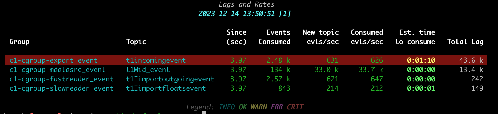

# kafka-lagstats

CLI app to monitor real-time consumption and production rates on kafka broker. Displays:

* Rate of events written to topics
* Rate of events consumed by consumer groups
* Shows LAG per consumer group and topic
* Calculates ETA for each consumer group to consume the remaining topic events
* Supports multiple topics/consumer group


# Usage
```
usage: kafka-lagstats [-h] [--kafka-broker KAFKA_BROKER] [--text] [--poll-period KAFKA_POLL_PERIOD] [--poll-iterations KAFKA_POLL_ITERATIONS]
                      [--group-exclude-pattern KAFKA_GROUP_EXCLUDE_PATTERN] [--group-include-pattern KAFKA_GROUP_INCLUDE_PATTERN] [--status] [--noinitial] [--hide-empty-groups]

Kafka consumer statistics

options:
  -h, --help            show this help message and exit
  --kafka-broker KAFKA_BROKER
                        Broker IP (default: localhost)
  --text                Only plain text, no rich output. (default: False)
  --poll-period KAFKA_POLL_PERIOD
                        Kafka offset poll period (seconds) for evts/sec calculation (default: 5)
  --poll-iterations KAFKA_POLL_ITERATIONS
                        How many times to query and display stats. 0 = Inf (default: 15)
  --group-exclude-pattern KAFKA_GROUP_EXCLUDE_PATTERN
                        If group matches regex, exclude (default: _[0-9]+$)
  --group-include-pattern KAFKA_GROUP_INCLUDE_PATTERN
                        Only include if group matches regex (default: None)
  --status              Report health status in json and exit. (default: False)
  --noinitial           Do not display initial lag summary. (default: False)
  --hide-empty-groups   Hide groups with no members. (default: False)
```

# Screenshot



